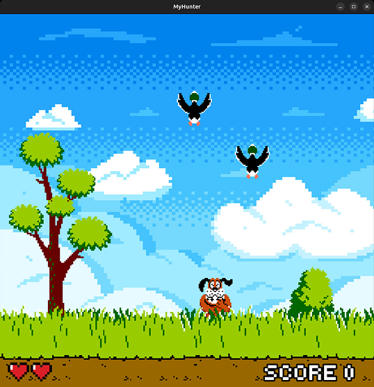
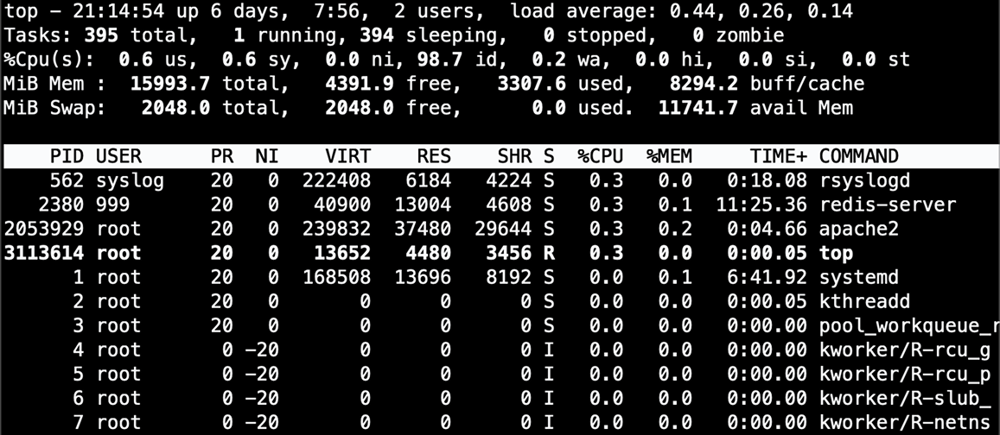
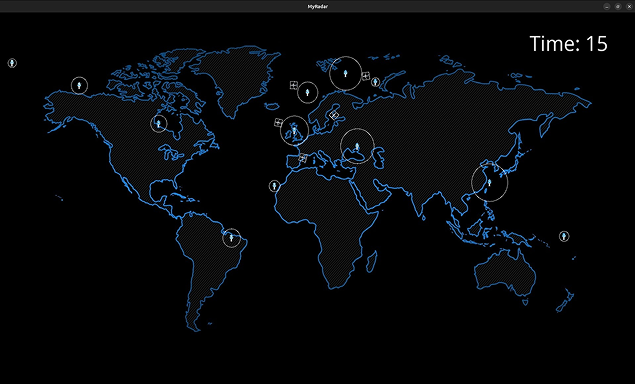

# ⛏️ Hello, I'm Nathanaël

🎓 First-year student at **Epitech**  
🧱 Learning by building, breaking, and rebuilding  
💻 C programming & Unix systems  

🔗 Navigation  
- [🏠 Spawn](#spawn)
- [🎒 Inventory](#inventory)
- [🏗️ Builds](#builds)
- [🚧 In Progress or coming soon](#in-progress)

  

## 🏠 Spawn
This portfolio documents my progression as a developer.  
My work is mainly composed of school projects focused on  
low-level programming, Unix systems, fundamental  
programming concepts, and simple graphical logic.  

---

## 🎒 Inventory
C · Linux · Git · Ncurses · CSFML

---

## 🏗️ Builds

### 🦆 my_hunter

🎯 Objective :  
&nbsp;&nbsp;Inspired by the Duck Hunt game released by Nintendo in 1984, create a  
&nbsp;&nbsp;simple game featuring hitboxes, defeat conditions, menus, sound design,  
&nbsp;&nbsp;and animations using the CSFML library.  

🧠 What I learned:
- Game loop fundamentals
- Use of spritesheets
- Event handling
- Basic rendering logic

---

### 🔌 my_top

🎯 Objective :  
&nbsp;&nbsp;Recreate the Linux `top` command in a team of two  
&nbsp;&nbsp;in order to better understand how a Unix  
&nbsp;&nbsp;system works, using the Ncurses library.  

🧠 What I learned:
- Parsing files
- Used a TUI library  
- Team working

---

### ✈️ my_radar

🎯 Objective :  
&nbsp;&nbsp;Render a 2D visualization panel simulating air traffic  
&nbsp;&nbsp;using a file containing planes and towers data as input  
&nbsp;&nbsp;with the CSFML librairy.  

🧠 What I learned:
- Hitbox detection
- Initialize sprites with parsed data  
- Optimization

---

## 🚧 In Progress or coming soon
- MiniShell
- Personnal 2D game in CSFML
